# fast   

## Installation

### Pre-compiled binaries

- Download a binary from [Releases](https://github.com/Kab1r/fast/releases)
- Change the file's permissions to be executable, `chmod +x fast`
- Move the binary to a location in your shell path

### Install from source

- Install Rust and Cargo using [rustup](https://rustup.rs/)
- Clone this repository and `cd` into it
- `cargo install --path .`

### Run in Docker

- `docker run -it ghcr.io/Kab1r/fast`

## License

